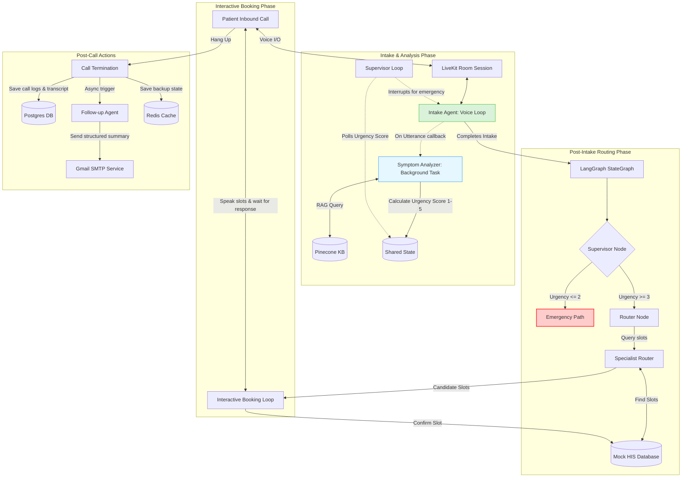

# TriageAI: AI-Powered Telephone Triage System

An advanced, AI-powered telephone triage system for hospitals and clinics. Patients call the system to report symptoms, verify their identity, and obtain immediate clinical guidance or book slots with appropriate specialists. 

The application utilizes a parallelized multi-agent voice pipeline. To the patient, it feels like a single seamless conversation with an empathetic assistant. Under the hood, multiple specialized agents and asynchronous workflows coordinate information collection, real-time safety assessments, and scheduling.

---

## System Architecture



---

## Core Features

### 1. Robust Sequential Intake
The **Intake Agent** follows a strict, step-by-step 12-step dialog sequence to build a cohesive medical profile before moving to scheduling:
* **Steps 1-4**: Identifies chief complaint, symptom onset/trigger, duration, and severity (1-10).
* **Step 5**: Asks targeted clinical follow-ups (e.g. pain radiation, type of cough, nausea) depending on the symptom category.
* **Step 6**: Clarifies boundary symptoms to check for red flags.
* **Steps 7-8**: Inquires about current treatments/remedies tried and known drug allergies.
* **Steps 9-12**: Collects name, date of birth, phone number, and email. Emails are spelled back character-by-character using hyphens for confirmation.
* **Standby Mode**: Once intake is complete, the Intake Agent enters a silent standby mode to silence LLM speech while the system retrieves slots.

### 2. Decoupled Real-Time Triage Engine
The **Symptom Analyzer** runs in the background parallel to the voice loop:
* **Retrieval-Augmented Generation (RAG)**: Embeds patient statements and queries Pinecone to identify matching ICD-10 categories.
* **Deterministic Emergency Override**: Evaluates critical indicators (`cardiac_red_flags`, `respiratory_distress`, `stroke_neurological_deficits`, `active_uncontrolled_bleeding`, and `active_self_harm_or_suicidal_intent`). The presence of any flag triggers an override, routing the call immediately to the Emergency path.
* **Triage Probing**: Vague or ambiguous boundary symptoms are scored as `3` (Urgent) to prompt further clarification rather than causing false alarms.
* **Specialty Normalization**: Automatically maps recognized medical complaints to normalized clinical departments (e.g. Cardiology, Orthopaedics, Gastroenterology, Psychiatry).

### 3. Interactive Scheduling & Booking
Instead of auto-booking appointments, the system offers an interactive scheduling flow:
* **Slot Proposals**: Proposes up to two candidate slots to the patient over the voice call.
* **Speech Control Overrides**: Overrides the STT listener during booking to capture simple affirmative/negative patient voice responses (e.g. "yes", "sure", "that works") without triggering standard LLM generation.
* **Fallback Booking**: Auto-books the earliest slot if all options are declined.
* **Resilience**: Stores data securely during PostgreSQL/Redis downtime and auto-heals call and patient database records if they are missing at the time of booking.

### 4. Post-Call Follow-ups
Once a call terminates, the **Followup Agent** generates an LLM-assisted, patient-friendly summary detailing:
* Confirmed booking info (doctor, department, date and time).
* Reported symptoms and clinical info (allergies, onset trigger, treatments tried).
* Standard preparation reminders (bringing ID, medication lists).
* Red-flag warnings instructing them to dial 911 if their condition worsens.
* Summaries are sent immediately to the patient via Gmail SMTP.

---

## Tech Stack
* **Communications**: LiveKit Cloud & Agents SDK (Python)
* **Speech-to-Text (STT)**: Groq (Whisper Large V3 Turbo)
* **Text-to-Speech (TTS)**: Cartesia (Sonic 3)
* **LLM Engine**: Mistral API (`mistral-small-latest`, `mistral-large-latest`)
* **Vector Database**: Pinecone
* **Relational Database**: PostgreSQL (via SQLAlchemy)
* **Caching**: Redis
* **Observability**: LangSmith

---

## Project Structure

```
TriageAI/
│
├── agents/                  # Voice and background agents
│   ├── intake_agent.py      # Voice conversation controller
│   ├── symptom_analyzer.py  # Background RAG & triage analyzer
│   ├── specialist_router.py # Slot lookup and booking coordinator
│   └── followup_agent.py    # Post-call email notification system
│
├── api/                     # FastAPI host layer
│   ├── main.py              # Server setup
│   ├── models.py            # Pydantic validation schemas
│   └── routers/             # Webhook and HIS scheduling routes
│
├── db/                      # Database logic and models
│   ├── database.py          # SQLAlchemy engine
│   ├── models.py            # SQL tables (Patient, Call, Doctor, Slot)
│   └── session_store.py     # Redis session caching
│
├── graph/                   # Workflow routing state machine
│   ├── state.py             # Shared state definitions
│   ├── supervisor.py        # Rules-based routing checks
│   └── triage_graph.py      # LangGraph configuration
│
├── rag/                     # Vector DB embedding and querying
│   ├── embedder.py          # Mistral query embeds
│   └── pinecone_client.py   # Pinecone API queries
│
├── scripts/                 # Administration scripts
│   ├── ingest_kb.py         # Knowledge base builder
│   └── seed_db.py           # Mock doctor/slot DB seeder
│
└── entrypoint.py            # LiveKit worker main entrypoint
```

---

## Local Setup & Installation

### 1. Prerequisites
Ensure you have the following installed on your machine:
* Python 3.10+
* Docker & Docker Compose
* PostgreSQL & Redis (staged locally or via Docker)

### 2. Configure Environment Variables


### 3. Start Database and Caching Services
Spin up Postgres and Redis containers:
```bash
docker-compose up -d
```

### 4. Install Dependencies
Set up a virtual environment and install Python packages

### 5. Ingest Knowledge Base
Before starting the system, ingest the ICD-10 medical records and symptom datasets into Pinecone. The script utilizes a local JSON cache to save embedding costs:
```bash
python scripts/ingest_kb.py
```

### 6. Seed the Relational Database
Populate your database with mock clinical specialties, doctors, and available appointment slots:
```bash
python scripts/seed_db.py
```

### 7. Run the Application
Start the FastAPI server (handling webhooks and mock HIS requests) in one terminal:
```bash
uvicorn api.main:app --reload --port 8000
```

Start the LiveKit agent worker in another terminal:
```bash
python entrypoint.py dev
```

---

## Verification & Testing
Run the complete unit and integration test suite to verify agent logic, RAG queries, and LangGraph traversals:
```bash
pytest
```